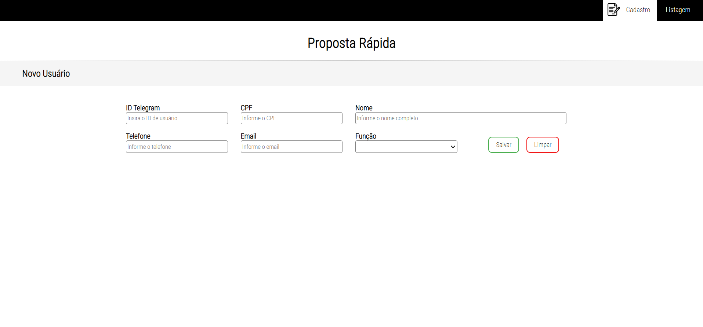

# formulario-cadastro-listagem

## Sobre o projeto

Visite a demonstração em: [https://patriciamsro.github.io/formulario-cadastro-listagem/index.html](https://patriciamsro.github.io/formulario-cadastro-listagem/index.html)


Este projeto consiste em uma tela de cadastro que permite a inserção de dois tipos de usuários `Supervisores` e `Revendedores`.

Também possui uma tela contendo a listagem dos usuários cadastrados que permite a exclusão destes usuários.

Este projeto é apenas o front-end utilizando HTML e CSS, nesta versão não há integração com o back-end.

Construí este projeto para contribuir com [@soterocra](https://github.com/soterocra) em seu projeto [demo-hexagonal](https://github.com/soterocra/hexagonal-demo), neste repositório o front-end está integrado com o back-end através de chamadas http.

## Tecnologias utilizadas

* HTML5
* CSS3

## Layout Web

### Tela de Cadastro:


### Tela de Listagem:


## Como executar o projeto

Basta fazer o donwload e abrir o `index.html`, porém, se desejar fazer tudo pelo terminal siga o passo a passo abaixo :stuck_out_tongue_winking_eye:: 

### - Windows:

Para clonar o projeto abra o terminal do **git bash**, em seguida faça o clone:
```bash
git clone https://github.com/patriciamsro/formulario-cadastro-listagem.git
```

Em seguida, acesse a pasta do projeto:
```bash
cd formulario-cadastro-listagem
```

Para abrir o projeto no seu navegador padrão:
```bash
start index.html
```

### - Linux:

Para clonar o projeto abra o terminal, em seguida faça o clone:
```bash
git clone https://github.com/patriciamsro/formulario-cadastro-listagem.git
```

Em seguida, acesse a pasta do projeto:
```bash
cd formulario-cadastro-listagem
```

Para abrir o projeto no **firefox**:
```bash
firefox index.html
```

Para abrir o projeto no **chrome**:
```bash
google-chrome index.html
```

## Autor

Patrícia Magalhães Sotero Rocha

[](https://www.linkedin.com/in/patr%C3%ADcia-sotero-71a803170/)
